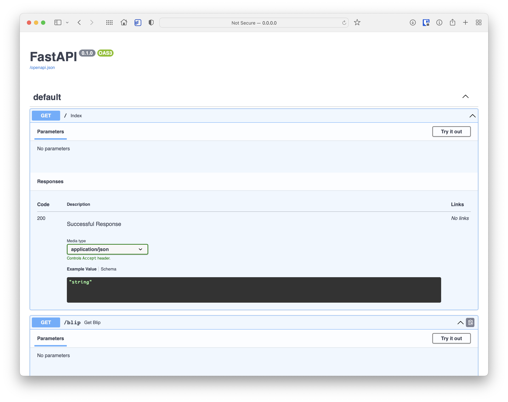
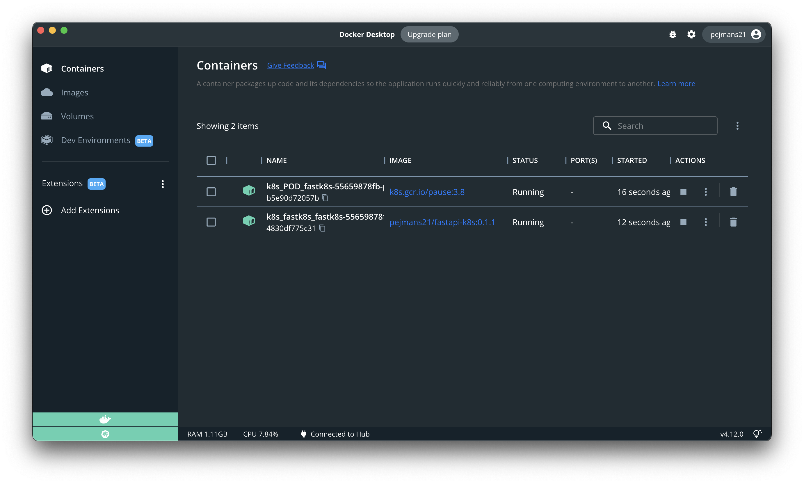

# FastAPI + K8s

## Local Setup 

```bash
pip install -r requirements.txt
uvicorn main:app --host 0.0.0.0 --port 8000 --reload
```


## Docker 

```bash
docker build -t pejmans21/fastapi-k8s:TAGNAME .
docker run -d -p 8000:8000 --name CONTAINERNAME pejmans21/fastapi-k8s:TAGNAME
```

### Push to Docker Hub

```bash
docker push pejmans21/fastapi-k8s:TAGNAME
```
---

## Kubernetes

<br>

* Apply [config file](./fastapi-k8s-config.yaml)

```bash 
kubectl apply -f fastapi-k8s-config.yaml

## Output
# service/fastk8s-service created
# deployment.apps/fastk8s created
```

* `kubectl get deployment`
```
NAME      READY   UP-TO-DATE   AVAILABLE   AGE
fastk8s   1/1     1            1           112s
```

* `kubectl get pods`
```
NAME                       READY   STATUS    RESTARTS   AGE
fastk8s-55659878fb-xp28j   1/1     Running   0          61s
```
---
<br>

* Apply [autoscaling config file](./fastapi-k8s-autoscale-config.yaml)

```bash 
kubectl apply -f fastapi-k8s-autoscale-config.yaml

## Output
# horizontalpodautoscaler.autoscaling/fastk8s-autoscale created
```

> Scale up or down if needed



---

### Delete Orchestration

```bash
kubectl delete deployment fastk8s
kubectl delete services fastk8s-service
kubectl delete hpa fastk8s-autoscale
```

* Output

```
deployment.apps "fastk8s" deleted
service "fastk8s-service" deleted
horizontalpodautoscaler.autoscaling "fastk8s-autoscale" deleted
```